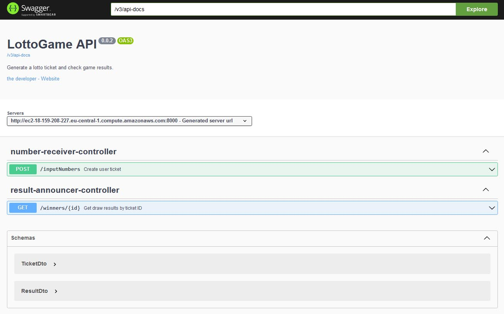

# Lotto Game App - Backend

### Game Rules
Player chooses 6 different numbers in range 1 to 99. System returns ticket with ID and next draw date.
Draw numbers takes place at 12.oo on every Saturday.
Player checks game results using ticket ID.

### Languages
This project was created with [Java](https://www.java.com/), [Spring Boot](https://spring.io/), [MongoDB](https://www.mongodb.com/), [Mockito](https://site.mockito.org), REST API, 
[Swagger](https://swagger.io/), [Docker](https://www.docker.com/) and Maven.
### Screens

